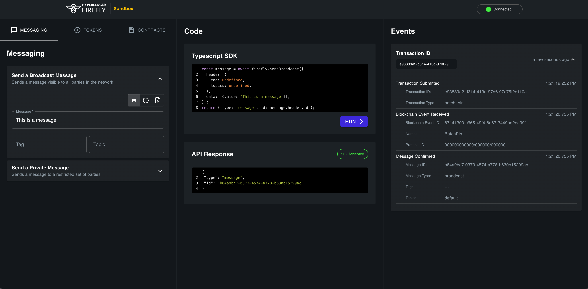

# FireFly Sandbox


[](https://hyperledger.github.io/firefly//)


This is an API exerciser and prototyping tool for applications that communicate with FireFly.

### Dashboard



## Setup

To run the application, you will require a 2-party FireFly system running
locally on ports 5000 & 5001. The easiest way to set this up is with the
[FireFly CLI](https://github.com/hyperledger/firefly-cli):

```
ff init sandbox 2
ff start sandbox
```

## Running

Once the FireFly stack is ready, set up and run the sample with:

```
cd server
npm install
npm run start:dev
```

```
cd ui
npm install
npm start
```

Your application should now be ready to use at [localhost:3000](localhost:3000).

## Git repositories

There are multiple Git repos making up the Hyperledger FireFly project. Some others
that may be helpful to reference:

- Core - https://github.com/hyperledger/firefly
- Command Line Interface (CLI) - https://github.com/hyperledger/firefly-cli
- FireFly Node.js SDK - https://github.com/hyperledger/firefly-sdk-nodejs

## Contributing

Interested in contributing to the community?

Check out our [Contributor Guide](https://hyperledger.github.io/firefly/contributors/contributors.html), and welcome!

Please adhere to this project's [Code of Conduct](CODE_OF_CONDUCT.md).

## License

Hyperledger Project source code files are made available under the Apache License, Version 2.0 (Apache-2.0), located in the [LICENSE](LICENSE) file.
